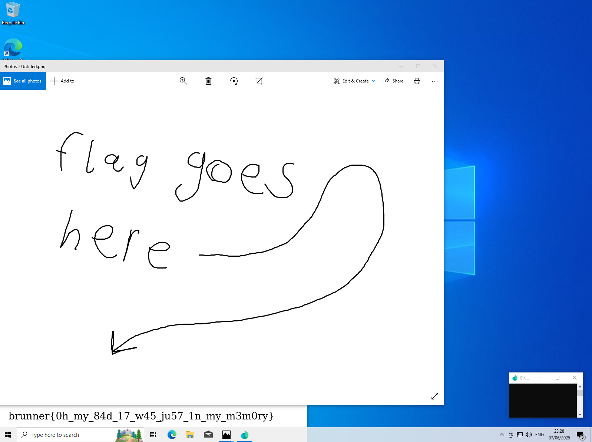

# Memory Loss

## Scenario

I had just finished baking a brunsviger when I suddenly remembered something important... but now I simply can't recall what it was! I'm pretty sure I took a picture of it, but where did I put it?

---

## Solution

The challenge has an attachment (memoryloss.dmp)

```bash
memoryloss.dmp: MS Windows 64bit crash dump, version 15.19045, 8 processors, DumpType (0x1), 524173 pages
```

It’s a simple memory dump, so we can start by using Volatility3.

```bash
python3 vol.py -f "memoryloss.dmp" windows.info 

# ===================================================

Kernel Base     0xf8017301c000
DTB     0x1aa000
Symbols file:///home/xxxx/Tool/volatility3/volatility3/symbols/windows/ntkrnlmp.pdb/89284D0CA6ACC8274B9A44BD5AF9290B-1.json.xz
Is64Bit True
IsPAE   False
layer_name      0 WindowsIntel32e
memory_layer    1 WindowsCrashDump64Layer
base_layer      2 FileLayer
KdVersionBlock  0xf80173c2b3a0
Major/Minor     15.19041
MachineType     34404
KeNumberProcessors      8
SystemTime      2025-06-07 21:28:35+00:00
NtSystemRoot    C:\Windows
NtProductType   NtProductWinNt
NtMajorVersion  10
NtMinorVersion  0
PE MajorOperatingSystemVersion  10
PE MinorOperatingSystemVersion  0
PE Machine      34404
PE TimeDateStamp        Fri May 20 08:24:42 2101
```

Based on the description, I need to find a picture in this dump.

First, I tried searching for image files...

```bash
xxx@xxx:~/Tool/volatility3$ python3 vol.py -f "memoryloss.dmp" windows.filescan | grep -Ei "\.(png|jpg|jpeg|bmp)$"
0xb207c3ab6c40.0\Users\CTF Player\AppData\Local\Packages\Microsoft.ScreenSketch_8wekyb3d8bbwe\TempState\{798C16B5-BC0A-49FB-921E-AA0FEE767691}.png
0xb207c3ab75a0  \Users\CTF Player\AppData\Local\Packages\Microsoft.ScreenSketch_8wekyb3d8bbwe\TempState\{798C16B5-BC0A-49FB-921E-AA0FEE767691}.png
0xb207c4372590  \Users\CTF Player\AppData\Roaming\Microsoft\Windows\Themes\CachedFiles\CachedImage_1600_1200_POS4.jpg
0xb207c43b06b0  \Program Files\WindowsApps\Microsoft.ScreenSketch_10.1907.2471.0_neutral_split.scale-100_8wekyb3d8bbwe\Assets\ScreenSketchSplashScreen.scale-100_contrast-black.png
0xb207c43b3d60  \Program Files\WindowsApps\Microsoft.ScreenSketch_10.1907.2471.0_x64__8wekyb3d8bbwe\Assets\ScreenSketchSquare44x44Logo.targetsize-32_altform-lightunplated.png
0xb207c43b5980  \Windows\ImmersiveControlPanel\images\logo.scale-100_altform-lightunplated.png
```

So I tried dumping all the files.

```bash
xxx@xxx:~/Tool/volatility3$ python3 vol.py -f "memoryloss.dmp" windows.dumpfiles --filter '\.(jpg|jpeg|png|bmp)$' --ignore-case
Volatility 3 Framework 2.26.2
Progress:  100.00               PDB scanning finished                                
Cache   FileObject      FileName        Result

DataSectionObject       0xb207c3ab75a0  {798C16B5-BC0A-49FB-921E-AA0FEE767691}.png      file.0xb207c3ab75a0.0xb207bef99c30.DataSectionObject.{798C16B5-BC0A-49FB-921E-AA0FEE767691}.png.dat
```

